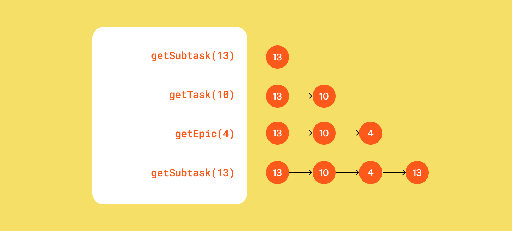

# Техническое задание

#### Менеджер теперь интерфейс

Из темы об абстракции и полиморфизме вы узнали, что при проектировании кода полезно разделять требования к желаемой
функциональности объектов и то, как эта функциональность реализована. То есть набор методов, который должен быть у
объекта, лучше вынести в интерфейс, а реализацию этих методов – в класс, который его реализует. Теперь нужно применить
этот принцип к менеджеру задач.

1. Класс `TaskManager` должен стать интерфейсом. В нём нужно собрать список методов, которые должны быть у любого
   объекта-менеджера. Вспомогательные методы, если вы их создавали, переносить в интерфейс не нужно.
2. Созданный ранее класс менеджера нужно переименовать в `InMemoryTaskManager`. Именно то, что менеджер хранит всю
   информацию в оперативной памяти, и есть его главное свойство, позволяющее эффективно управлять задачами. Внутри
   класса должна остаться реализация методов. При этом важно не забыть имплементировать `TaskManager`, ведь в Java класс
   должен явно заявить, что он подходит под требования интерфейса.

#### История просмотров задач

Добавьте в программу новую функциональность — нужно, чтобы трекер отображал последние просмотренные пользователем
задачи. Для этого добавьте метод `getHistory()` в `TaskManager` и реализуйте его — он должен возвращать последние 10
просмотренных задач. Просмотром будем считаться вызов у менеджера методов получения задачи по идентификатору —
`getTask()`, `getSubtask()` и `getEpic()`. От повторных просмотров избавляться не нужно.

Пример формирования истории просмотров задач после вызовов методов менеджера:

У метода `getHistory()` не будет параметров. Это значит, он формирует свой ответ, анализируя исключительно внутреннее
состояние полей объекта менеджера. Подумайте, каким образом и какие данные вы запишете в поля менеджера для возможности
извлекать из них историю посещений. Так как в истории отображается, к каким задачам было обращение в
методах `getTask()`,
`getSubtask()` и `getEpic()`, эти данные в полях менеджера будут обновляться при вызове этих трех методов.

Обратите внимание, что просмотрен может быть любой тип задачи. То есть возвращаемый список задач может содержать объект
одного из трех типов на любой своей позиции. Чтобы описать ячейку такого списка, нужно вспомнить о полиморфизме и
выбрать тип, являющийся общим родителем обоих классов.
 
 

##### Как отобразить в коде историю просмотров

История просмотров задач — это упорядоченный набор элементов, для хранения которых отлично подойдёт список. При создании
менеджера заведите список для хранения просмотренных задач. Этот список должен обновляться в методах `getSubtask()` и
`getEpic()` — просмотренные задачи должны добавляться в конец.

##### Обновление истории просмотров

Учитывайте, что размер списка для хранения просмотров не должен превышать десяти элементов. Если размер списка исчерпан,
из него нужно удалить самый старый элемент — тот который находится в начале списка.

##### Где пригодится тип списка просмотренных задач

Для списка просмотренных задач нужен тип `Task`. Метод `getHistory()` должен возвращать список именно такого типа. В
итоге
он будет выглядеть так — `List<Task> getHistory()`.

### Утилитарный класс

Со временем в приложении трекера появится несколько реализаций интерфейса `TaskManager`. Чтобы не зависеть от
реализации, создайте утилитарный класс `Managers`. На нём будет лежать вся ответственность за создание менеджера задач.
То
есть `Managers` должен сам подбирать нужную реализацию `TaskManager` и возвращать объект правильного типа.
У `Managers` будет метод  `getDefault()`. При этом вызывающему неизвестен конкретный класс, только то, что объект,
который возвращает `getDefault()`, реализует интерфейс `TaskManager`.
Метод `getDefault()` будет без параметров. Он должен возвращать объект-менеджер, поэтому типом его возвращаемого
значения будет `TaskManager`.

### Статусы задач как перечисление

Так как варианты возможных статусов у задачи ограничены, для их хранения в программе лучше завести перечисляемый тип
`enum`.

##### Как перенести статусы задач в enum

Ранее мы использовали для хранения статусов задач тип `String` — теперь три соответствующих поля в классе нужно
объединить
в `enum` с тремя значениями. Не забудьте, что все элементы перечисления принято писать как константы: в верхнем
регистре.

### Тестирование вашего решения

Убедитесь, что ваше решение работает! В главном классе воспроизведите несложный пользовательский сценарий:

- создайте несколько задач разного типа.
- вызовите разные методы интерфейса TaskManager и напечатайте историю просмотров после каждого вызова. Если код рабочий,
  то история просмотров задач будет отображаться корректно.

### Сделайте историю задач интерфейсом

Создайте отдельный интерфейс для управления историей просмотров — `HistoryManager`. У него будет два метода.
Первый `add(
Task task)` должен помечать задачи как просмотренные, а второй `getHistory()` — возвращать их список.

Объявите класс `InMemoryHistoryManager` и перенесите в него часть кода для работы с историей из класса
`InMemoryTaskManager`. Новый класс `InMemoryHistoryManager` должен реализовывать интерфейс `HistoryManager`.

Добавьте в служебный класс `Managers` статический метод `HistoryManager getDefaultHistory()`. Он должен возвращать
объект
`InMemoryHistoryManager` — историю просмотров.

Проверьте, что теперь `InMemoryTaskManager` обращается к менеджеру истории через интерфейс `HistoryManager` и использует
реализацию, которую возвращает метод `getDefaultHistory()`.

Ещё раз всё протестируйте!

